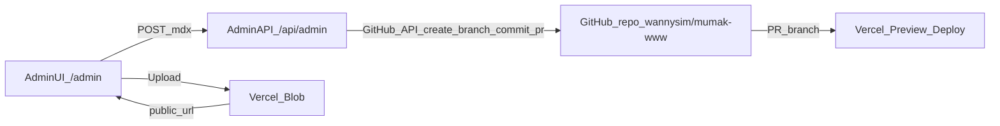

# 블로그 글 작성(Admin) + PR 발행 플로우

## 목표/배경

- 현재 블로그는 `apps/blog/content/{locale}/{category}/{slug}.mdx` 파일을 `fs`로 읽어 렌더링합니다(예: `apps/blog/lib/posts.ts`).
- Vercel 프로덕션 런타임에서는 **파일 시스템에 새 글을 “저장”하는 방식이 불가능**하므로, 웹에서 글을 쓰려면 **GitHub에 커밋/브랜치/PR을 생성하는 방식**(또는 외부 CMS로 이전)이 필요합니다.
- 사용자가 선택한 방향은 **커스텀 /admin + PR 워크플로우**이므로, 글 작성 UI는 `apps/blog` 내부에 두고, 저장/발행은 GitHub API로 PR을 생성해 Vercel Preview 배포로 검증한 뒤 머지로 발행합니다.

## 제안 아키텍처(요약)

- **작성 UI**: `apps/blog/app/admin/*` (블로그 앱 내부 `/admin`)
- **발행(서버)**: `apps/blog/app/api/admin/*` Route Handler
- **GitHub 연동**: 서버에서 PAT(또는 GitHub App 토큰)로 브랜치 생성 → 파일 커밋 → PR 생성
- **이미지**: 1차는 Vercel Blob 업로드 → 생성된 URL을 MDX에 삽입(Repo에 바이너리 커밋을 피함)

## 구현 계획

### 1) /admin 화면(작성/편집)

- `apps/blog/app/admin/login/page.tsx`: 관리자 로그인(비밀번호 기반)
- `apps/blog/app/admin/page.tsx`: 글 작성 폼
- 필드: locale(ko/en), category(essay/articles/notes), slug, title, description, date, tags, draft, body(MDX)
- UX: slug 자동 생성(영문 제목일 때), 카테고리/로케일 선택, frontmatter 자동 생성
- (선택) 기존 글 목록 로드 → 클릭 시 내용 로드 후 수정 PR 생성

### 2) 인증(최소 구현)

- Vercel에 `ADMIN_PASSWORD`(및 `ADMIN_SESSION_SECRET`)를 설정
- `apps/blog/app/api/admin/login/route.ts`: 비밀번호 검증 후 서명된 세션 쿠키 발급
- `apps/blog/lib/admin/auth.ts`: HMAC 서명 쿠키 검증(`timingSafeEqual`), 만료 처리
- 모든 `/api/admin/*`는 쿠키 검증 필수

### 3) GitHub PR 생성 API

- Vercel에 `GITHUB_TOKEN`(fine-grained PAT) 설정
- 권한: Contents(read/write), Pull requests(read/write)
- `apps/blog/lib/admin/github.ts`: GitHub API 래퍼(브랜치 생성, 파일 create/update, PR 생성)
- `apps/blog/app/api/admin/publish/route.ts`:
- 입력: locale/category/slug + MDX 텍스트
- 처리: `apps/blog/content/{locale}/{category}/{slug}.mdx` 경로로 커밋
- 결과: PR URL 반환
- PR 제목/설명 템플릿(요약, 변경 파일, 검토 포인트 포함)

### 4) 이미지 업로드(권장: Vercel Blob)

- Vercel Blob 스토어 연결 후 `BLOB_READ_WRITE_TOKEN` 설정
- `apps/blog/app/api/blob/upload/route.ts`: 클라이언트 업로드용 엔드포인트(Blob 업로드/URL 반환)
- Admin UI에서 이미지 파일 선택 → 업로드 → `` 형태로 본문에 삽입
- `apps/blog/next.config.mjs`의 `images.remotePatterns`에 **Vercel Blob 도메인 패턴**을 추가(Blob URL이 Next Image allowlist에 걸리지 않게)

### 5) MDX 이미지 렌더링 개선(소규모)

- 현재 `apps/blog/mdx-components.tsx`의 `img`는 고정 `width/height(800x400)`만 사용하므로 비율이 깨질 수 있음
- `img` props에서 `width/height`(존재 시) 반영, 없으면 기본값 사용하도록 개선
- 필요 시 MDX에서 `` 형태로 정확한 비율 지정 가능

## 운영/사용 흐름

- `/admin/login`에서 로그인
- 글 작성 후 “PR 생성” 버튼 클릭
- 생성된 PR 링크로 이동 → Vercel Preview URL에서 렌더링/SEO 확인
- 머지하면 자동으로 Production 배포(기존과 동일)

## 리스크/주의사항

- **보안**: `/admin`은 반드시 인증 필요(비밀번호+서명 쿠키). 토큰은 서버 환경변수로만 사용.
- **Draft 처리**: Vercel Preview도 `NODE_ENV=production`일 수 있어, draft 글이 안 보일 수 있음. PR 기반 워크플로우에서는 보통 draft=false로 두고 PR 미리보기로 검증하는 방식이 단순합니다(필요 시 draft 필터링 로직을 `VERCEL_ENV` 기준으로 조정하는 옵션도 포함).
- **이미지 도메인 allowlist**: Blob/Cloudinary 등 외부 URL을 쓰면 `next.config.mjs`에 allowlist를 반드시 반영해야 합니다.

## 변경 예정 파일(초안)

- Add: `apps/blog/app/admin/login/page.tsx`
- Add: `apps/blog/app/admin/page.tsx`
- Add: `apps/blog/app/api/admin/login/route.ts`
- Add: `apps/blog/app/api/admin/publish/route.ts`
- Add: `apps/blog/lib/admin/auth.ts`
- Add: `apps/blog/lib/admin/github.ts`
- (선택) Add: `apps/blog/app/api/blob/upload/route.ts`
- Update: `apps/blog/next.config.mjs`
- Update: `apps/blog/mdx-components.tsx`

## 완료 기준(Definition of Done)

- /admin에서 글 작성 → PR 생성까지 1회 클릭으로 완료
- PR Preview 배포에서 새 글이 정상 렌더링